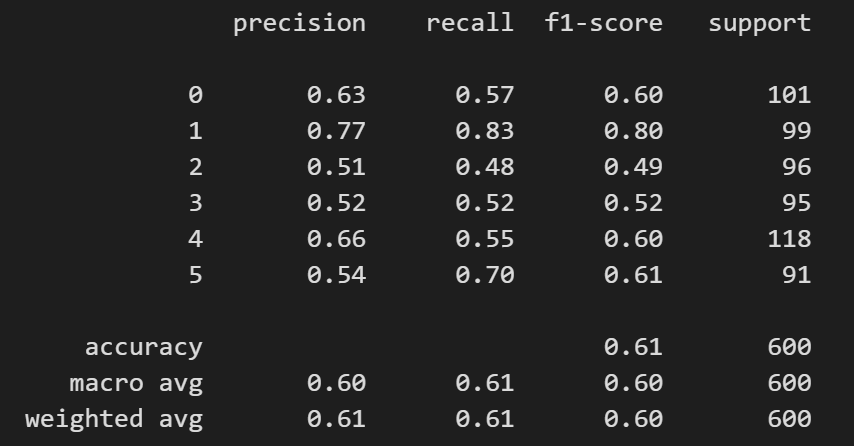
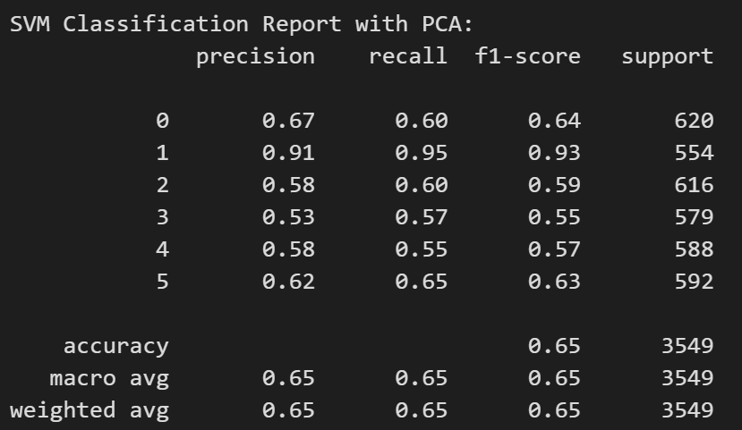
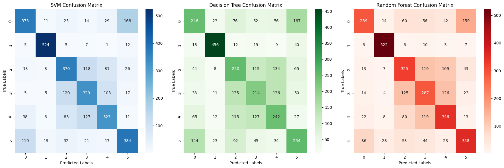

## Introduction

This report describes the development, evaluation and deployment of a machine learning model for the task of image classification. The goal was to classify images into six distinct categories: Buildings, Forest, Glacier, Mountain, Sea, and Street. The dataset used for training and testing comprised images representative of these classes, with a notable imbalance in the number of samples per class.


## Repository Structure

This directory structure outlines the organization of the image classification project:

* **Confusion_Matrix.png** (Image file): Screenshot of the model's confusion matrix.
* **Readme.md** (Markdown file): The project's main documentation, containing details, instructions, and usage information (you're reading it now!).
* **Oversampling.png** (Image file): Depicts the impact of oversampling on the model's performance visually.
* **Undersampling.png** (Image file): Depicts the impact of undersampling on the model's performance visually.
* **app.py** (Python file): Core logic for the Flask web application, handling server startup and image classification.
* **requirements.txt** (Text file): Lists all external Python libraries required to run the project. Use `pip install -r requirements.txt` for installation.
* **Notebook.ipynb** (Jupyter Notebook file): Contains the code used for model development and experimentation.
* **Templates/ folder** (Directory): Stores the HTML templates defining the web application's user interface structure and layout.
    * **index.html** (HTML file): The main HTML file defining the web page where users upload images and view classification results.
* **model/ folder** (Directory): Stores the serialized model artifacts used for image classification.
    * **pca_model.pkl** (Pickle file): Contains the serialized PCA transformation model used for dimensionality reduction.
    * **svm_classifier.pkl** (Pickle file): Contains the serialized SVM classification model used for predicting image categories.


## Usage and Installation

### Prerequisites:

- Python 3.x 

**Clone this repository using git**:

```bash
git clone https://github.com/souravhada/ML-ImageClassification-HandcraftedFeatures
```

**Navigate to the project directory**:

```bash
cd image-classification-flask-app
```

**Install the required dependencies using pip**:

```bash
pip install -r requirements.txt
```

Running the Application:

**Start the Flask development server:**

```bash
python app.py
```

Open your web browser and navigate to http://127.0.0.1:5000/ (replace 127.0.0.1 with your local machine IP if running on a different machine).

The web interface will allow you to upload an image for classification. The application will process the image and display the predicted category.

**Notes**: *The requirements.txt file specifies all the necessary Python libraries used in the project.*

# Analysis 

## Data Preparation

The images were initially extracted from a publicly accessible Google Drive link. Initial observations revealed an imbalance in the dataset: the Forest category contained significantly more samples (2,745) compared to the other categories (500 each), which presented a challenge for model training due to potential bias towards the Forest class.

## Feature Engineering

### Initial Approach
**Grayscale Conversion**:All images were converted from RGB to grayscale to reduce complexity.
**Edge Detection**: Canny edge detection was employed to highlight the shapes within the images.
**Flattening**: The grayscale matrices were flattened into vectors. However, this initial method provided suboptimal results, with an F1-score of less than 40% for all classes except the Forest class. The approach likely failed to capture sufficient discriminative features necessary for effective classification across varied categories.


### Advanced Techniques

**Histogram of Oriented Gradients (HOG)**, **Local Binary Patterns (LBP)**, and **Scale-Invariant Feature Transform (SIFT)**: These techniques were utilized to extract more comprehensive features from the images. HOG helps in capturing edge or gradient structure that is very characteristic of local shapes, LBP is excellent for texture classification, and SIFT extracts key points that are invariant to scale and rotation, making these features robust to changes in images.
**Normalization and Vector Sizing**: The feature vectors were normalized and either padded or truncated to maintain a uniform length of 45,000, which was determined based on the average vector size observed after combining all features into a single vector (approximately 43,600).

## Model Selection and Training

Given the nature of the problem, traditional machine learning algorithms were initially selected:
- **Support Vector Machines (SVM)**
- **Decision Trees**
- **Random Forests**

These models were chosen for their proven effectiveness in handling classification tasks, each employing a distinct approach to decision-making. SVMs are known for their high accuracy in high-dimensional spaces, which is typical for image data transformed into feature vectors. Decision Trees were included to test a tree-based approach, and Random Forests were trained to potentially enhance the model if the tree-based approach was giving promising results.

## Handling Class Imbalance

Two strategies were implemented to address the imbalance in the dataset:
- **Oversampling**: Data augmentation techniques were used to increase the number of samples in underrepresented classes to 2,745, matching the Forest class.
- **Undersampling**: The number of Forest samples was reduced to 500 to match the other classes. This method was faster computationally but less accurate.

Ultimately, oversampling was chosen for the final model due to its superior performance in maintaining class representation.

## Dimensionality Reduction

To address the computational challenges posed by the large number of features, **Principal Component Analysis (PCA)** was applied to reduce the feature dimensions to 150 components, significantly speeding up computation without a noticeable loss in accuracy.

## Model Evaluation

The models were evaluated using several metrics:
- **Accuracy**
- **Recall**
- **F1-Score**
- **Support Count**

A confusion matrix was also generated for each model to visualize performance across different classes, highlighting any persistent biases, particularly towards the Forest class.

### Evaluation Metrics and Results

The final models' performance, detailed in classification reports, is summarized as follows:

- **SVM Classification Report with PCA:**
  - Building: 67% precision, 60% recall, 0.64 F1-score
  - Forest: 91% precision, 95% recall, 0.93 F1-score
  - Overall accuracy: 65%

- **Decision Tree Classification Report with PCA:**
  - Building: 45% precision, 40% recall, 0.42 F1-score
  - Forest: 86% precision, 82% recall, 0.84 F1-score
  - Overall accuracy: 47%

- **Random Forest Classification Report with PCA:**
  - Building: 67% precision, 47% recall, 0.55 F1-score
  - Forest: 90% precision, 94% recall, 0.92 F1-score
  - Overall accuracy: 60%

## Deployment on Flask

The best-performing model, SVM, was selected for final deployment. Both the SVM model and PCA transformation were saved using pickle for integration into a Flask-based web application. The Flask web application integrates the machine learning model to classify images into six distinct categories in real-time. This application uses the trained SVM model and PCA transformation, which are loaded from pickle files. Users can upload images through a simple web interface, and the application processes and classifies these images using the same preprocessing and feature extraction methods employed during training. 


## Web Page Template
The web page for the Flask application includes a user-friendly interface designed using HTML and styled with CSS. The main page includes a form for uploading images, which are then sent to the server for classification. Results, include predicted categories and are dynamically displayed on the same page. The design emphasizes simplicity and functionality, ensuring that users can easily navigate and use the application.

## Challenges and Further Improvements

Despite efforts to balance the classes, the final model still showed bias towards the Forest category. Possible reasons for this could include inherent differences in image features that are more distinctively captured in forest images, or residual effects from the initial imbalance in training data. Due to time and computational constraints, we could not do further experimentation. However, there is potential to enhance the model's accuracy by altering the set of features used. Additionally, while we chose the number of PCA components as 150, this parameter can be optimized using methods such as the cumulative explained variance ratio.

Additionally, to further automate and enhance the feature extraction process, we can  use deep learning models such Convolutional Neural Networks (CNNs) that can automatically learn optimal features from raw images. We can also use pre-trained models through transfer learning which can improve accuracy by utilising previously learned feature representations.

## Credits
Special thanks to Google Colab and Kaggle Notebooks for providing the computational resources that greatly assisted in this project.


## Appendix

This appendix includes visual documentation to enhance understanding of the model evaluations. It includes comparison images of classification metrics for SVM with undersampling versus oversampling, along with confusion matrices for SVM, Decision Tree, and Random Forest models. 

### SVM Classification Metrics: Undersampling vs. Oversampling





### Confusion Matrix for SVM Model, Decision Tree and Random Forest Model

